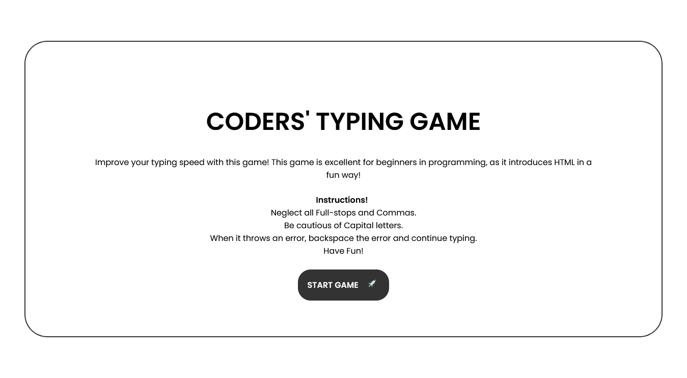

# CODERS' TYPING GAME

## Table of contents

- [Overview](#overview)
  - [Screenshot](#screenshot)
  - [Links](#links)
  - [Built with](#built-with)
- [Developer](#developer)

## Overview
This game is excellent for beginners in programming, instructors can use it to spring up students interest in HTML. It introduces HTML in a fun way!

### Screenshot

### Links

- Solution URL: [https://github.com/Igho-Okeoghene/Typing-Game](https://github.com/Igho-Okeoghene/Typing-Game)
- Live Site URL: [https://igho-okeoghene.github.io/Typing-Game/](https://igho-okeoghene.github.io/Typing-Game/)

## My process

- Set up the HTML structure first
- Worked on the styling with CSS and Media Queries
- Finshed up the functionalites with JavaScript

### Built with

- Semantic HTML5 markup
- CSS custom properties
- Mobile-first workflow
- JavaScript

### Useful resources

- [W3SCHOOLS](https://www.w3schools.com)

## Author

- Website - [Okeoghene Eunice Igho](https://github.com/Igho-Okeoghene)
- LinkedIn - [Okeoghene Eunice](https://www.linkedin.com/in/okeoghene-eunice-igho)
- Twitter - [@Eunicodes](https://www.twitter.com/eunicodes)
